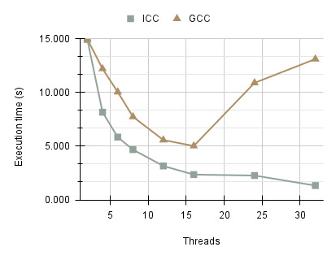
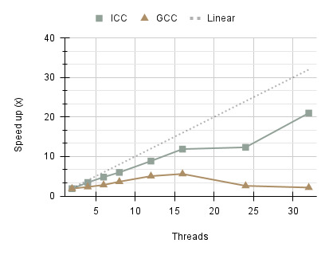
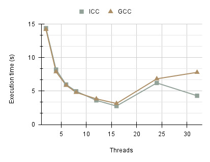
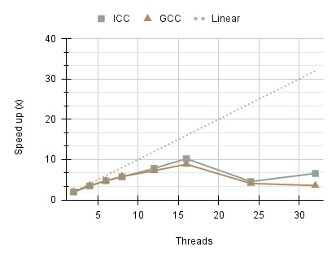
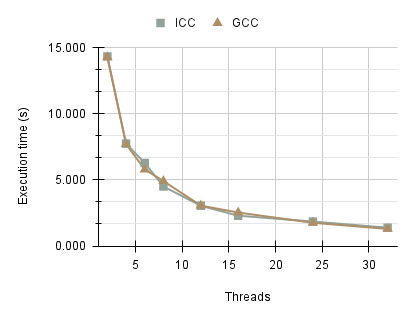
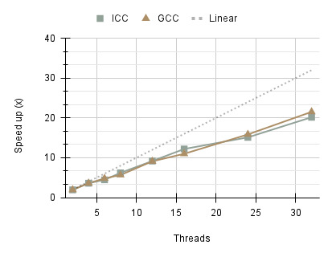

# TP Coursework 2
This repository contains the source code for Threaded Programming Coursework 2. Included are the following OpenMP programs:
- Solver 1 (Recursive Tasks)
- Solver 2 (Shared Queue)
- Solver 2 (Separate Queues)

The programs use a divide-and-conquer algorithm for an adaptive quadrature method that computes the integral of a function on a closed interval.  The
algorithm starts by applying two quadrature rules (3-point and 5-point Simpson’s
rules) to the whole interval. If the difference between the integral estimates from
the two rules is small enough (or the interval is too short), the result in added to
the total integral estimate. If it is not small enough, the interval is split into two
equal halves, and the method is applied recursively to each halves, and the method is applied recursively to each half. The evaluating the function requires the solution of an ODE (ordinary differential equation) which is relatively expensive in time.

# Building

## Requirements
- OpenMP (201511)
- ICC 20.4 or GCC 10.2.0
- Slurm v22.05.11
- C99


To build all programs run the following command:
```
make -j
```

# Running
Each program can be executed from the root directory:
```
./bin/solver1
./bin/solver2_shared
./bin/solver2_separate
```

# Running on Cirrus
Each program can be submitted to Cirrus using Slurm.

*Note: Make sure that you set you account code in the slurm script prior to submitting the job.*

```
sbatch solver1.slurm
sbatch solver2_shared.slurm
sbatch solver2_separate.slurm
```

Once a job has completed a new Slurm log file will be generated with a ```.out``` extension in the bin directory:
```
./bin/solver1-[id].out
./bin/solver2_shared-[id].out
./bin/solver2_separate-[id].out
```

# Findings

## Solver 1 (Recursive Tasks)
The first program, Solver 1, implements the divide-and-conquer algorithm recursively using OpenMP tasks. A parallel region is created at the root simpson function call, executed by a single thread. During the recursive process, when an interval is divided into two, a new task is created for each half. Before returning from a recursive call, a taskwait directive is used to ensure that both subtasks have finished execution.

The execution times indicate two varying performance characteristics between ICC v20.4 (Intel C/C++ Compiler) and GCC v10.2.0 (GNU Compiler Collections). The Intel compiler consistently outperforms GCC on all thread counts, showing strong scalability. This can be attributed to compiler optimisations which produce more efficient assembly instructions for the Intel Xeon E5-2695 processor used on the Cirrus compute node. Beyond 16 threads, GCC performance deteriorates significantly, with a sharp increase in execution time and therefore, decline in scalability. The runtime disparity between the compilers reaches 11.776 seconds on 32 threads. Inefficiencies in the compiler and increased overhead associated with task creation may be the contributing factors. Further analysis was carried out to determine whether these results were specifically isolated to GCC version 10.2.0. Versions 8.2.0 and 12.3.0 exhibited similar behaviour, suggesting that the issue may stem from a long standing bug or inefficiency in the compiler’s code generation. The results are also shown in terms of speed up indicating that ICC was able to achieve the highest speed-up of 20.995x compared to GCC 2.143x on 32 threads.




## Solver 2 (Shared Queue)

Solver 2 implements the same algorithm but utilises a LIFO (Last-In-First-Out) queue for managing intervals. OpenMP locks were introduced to ensure thread-safe enqueuing and dequeuing operations on the shared queue. The termination criteria was revised to account for scenarios where the queue might be empty while intervals are still being processed. As a result, the computation only completes when the queue is empty and no threads remain active.

The execution times for both the ICC and GCC compilers are similar, with standard deviations of 8.084 and 7.719 seconds, respectively. Execution times generally decrease as the number of threads increases. However, beyond 16 threads, both compilers exhibit an increase in execution time of approximately 3.567 seconds, with performance becoming more irregular. This is attributed to the synchronisation overhead introduced by frequent locking and unlocking of the shared queue as threads compete for access. Consequently, the performance gains achievable with this implementation are inherently limited by this bottleneck, highlighting the need for alternative approaches. Another factor affecting performance is the lack of load balancing, which results in certain threads having more work whilst others are idle.




## Solver 2 (Separate Queues)

To address the performance limitations of using a shared queue, a second implementation of Solver 2 was developed in which each thread maintains its own separate queue. If the current threads queue is not empty, then an interval is dequeued. However, if it is empty, then the thread attempts to “steal work” from another thread for processing. Work is distributed in a round-robin fashion to ensure load balancing, keeping the number of tasks in each thread’s queue roughly equal. Each queue access is again synchronised using OpenMP locks.

Performance results, demonstrate a significant improvement compared to the first Solver 2 using a single queue. The program reduces contention for queue access, as each thread operates on its queue, leading to better scalability with larger thread counts, aligning with Amdahl’s Law. The execution time is comparable to that of Solver 1 using the ICC compiler. The speed up increasing sub-linearly for both compilers, reaching a maximum of 20.174x and 21.523x for ICC and GCC respectively on 32 threads.



